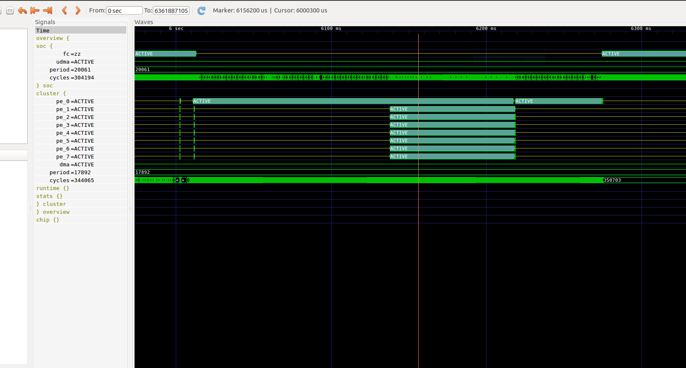

# Introduction

GVSOC is a lightweight, highly flexible instruction set simulator based on PULP project, which supports GreenWaves' GAP8 IoT application processor. GVSOC allows execution of programs on a virtual platform without any hardware limits. Thanks to DPI device models full application with a subset of peripherals can be simulated. Currently, we provide simulations of devices such as cameras, microphones, LCDs, etc. We are continually adding more peripheral models and you are, of course, welcome to add your own!

For further information about GVSOC, and other target chip please visit: https://github.com/pulp-platform

# GVSOC installation

The installation of gvsoc has been fully integrated into the GAP SDK install process. Once you have folowed the GAP SDK install process, the command "make all" in gap_sdk, will install GVSOC for GAP8 in your SDK. You could of cause install it alternatively by executing the following commands:

~~~~~shell
cd ~/gap_sdk
make gvsoc
~~~~~

# How to start compiling and running applications on GVSOC

Before running the applications, please make sure:

 - The toolchain has been installed successfully.
 - The SDK has been built without error.
 - The shell environment has been configured correctly for the GAP8 SDK.

## How to compile and run the "Hello World” example on GVSOC

The hello world example gets each core to print out a hello message. We will go through this example in detail so that you can learn how to schedule tasks on the cluster.

Like other examples and applications, this example is located in the "examples" folder:

~~~~~shell
	cd examples/pulp-examples/hello_world
~~~~~

Then execute this command for compiling and running the example on GVSOC:

~~~~~shell
	make clean all run platform=gvsoc
~~~~~

Of course, you can also compile and execute the example separately.

~~~~~shell
	make clean all
	make run platform=gvsoc
~~~~~

In the result, you will see the Hello from all the cores in FC and in Cluster, with their Cluster IDs and Core IDs.
All the examples can be built and run with the same procedure.

# How to run the application with system trace

The virtual platform provides the ability to dump system traces to aid in debugging.

To activate this function, you just need to add 1 parameter in your execution command:

~~~~~shell
	make run platform=gvsoc trace=<options of trace>
~~~~~

##Trace options

Through options, the trace information can be filtered, but it is sometimes difficult is to find out which options should be activated to get the needed information. One method is to dump all the events with trace=all, then find out which ones are interesting and then select them in the run command. Here are the available options :

Options | Description
|---|:---:|
insn    |   All the instuction traces
fc      |   All the FC operations
udma    |   Trace for uDMA unit
l2      |   All L2 memory operations
l1      |   All L1 memory operations

Here are the paths for the main components, which can be used as options :

Path           |                           Description
|---|:---:|
/sys/board/chip/cluster/pe0              | Processing element, useful to see the IOs made by the core, and the instruction it executes. You can add */iss* to just get instruction events
/sys/board/chip/cluster/event_unit       | Hardware synchronizer events, useful for debugging inter-core synchronization mechanisms
/sys/board/chip/cluster/pcache           | Shared program cache accesses
/sys/board/chip/cluster/l1_ico           | Shared L1 interconnect
/sys/board/chip/cluster/l1/bankX         | L1 memory banks (the X should be replaced by the bank number)
/sys/board/chip/soc/l2                   | L2 memory accesses
/sys/board/chip/cluster/dma              | DMA events

Primarily, the most interesting traces are the core instruction traces. They show not only the instructions executed but also the registers accessed, their content and the memory accesses and they are very useful for debugging bugs such as memory corruptions.

## Instruction traces

Here is an example of an instruction trace: ::

  4890000: 489: [/sys/board/chip/soc/cluster/pe0/insn] M 1c001252 p.sw  0, 4(a5!)  a5=10000010  a5:1000000c  PA:1000000c

The event information dumped for executed instructions uses the following format:

  \<address\> \<instruction\> \<operands\> \<operands info\>

\<address\> is the address of the instruction.

\<instruction\> is the instruction label.

\<operands\> is the part of the decoded operands.

\<operands info\> is gives details about the operands values and how they are used.

The latter information is using the following convention:

  - When a register is accessed, its name is displayed followed by *=* if it is written or *:* if it is read. In case it is read and written, the register appears twice. It is followed by its value, which is the new one in the case that it is written.

  - When a memory access is done, *PA:* is displayed, followed by the address of the access.

  - The order of the statements follows the order of the decoded instructions

The memory accesses which are displayed are particularly interesting for tracking memory corruptions as they can be used to look for accesses to specific locations.

## How to dump a trace to a file

By default, all traces are dumped to standard output. It is also possible to specify the file where the traces should be dumped. The file must be given for every –trace option. The same file can be used, to get all traces into the same file, or different files can be used.

Here is an example to get all possible traces into one file:

make run platform=gvsoc trace=insn:log.txt

Then you can find the file "log.txt" in BUILD/GAP8/GCC_RISCV/

# How to run an application with VCD trace

The virtual platform can also dump VCD traces which show the state of several components over time, like the core’s PC (program counter), DMA transfers, etc. This gives a better overview than system traces.

VCD tracing can be activated through the option vcd=1:

~~~~shell
make clean all run platform=gvsoc vcd=1
~~~~

Once the platform is run, this will generate a VCD file called all.vcd in the build folder. This file is a raw file containing all the signal values.

Another file called view.gtkw is generated and can be opened using GTKwave. This is a script file which will setup the view with the most interesting signals. The command to be executed is displayed at the beginning of the simulation when VCD traces are enabled.

GTKWave is a fully featured GTK+ based wave viewer for Unix, Win32, and Mac OSX which reads LXT, LXT2, VZT, FST, and GHW files as well as standard Verilog VCD/EVCD files and allows their viewing.

With this command, the gtkwave will be triggered automatically, and all the traces will be displayed like below:

{ width=1280px }

# Devices Configuration

When using a simulation platform, the default configuration is usually only activating very few peripherals. Additional peripherals can be added by customizing the default configuration with a specific section in the user configuration.

The devices to be simulated must be specified in the user INI configuration, like file "config.ini". A section with name board.devices. \<device\> must be added for each device. \<device\> is the name of the peripheral in the architecture and can be any unique name.

Here's our devices module list:

| Name        | Path                     | Description                                                            | Supported platforms |
|---|:---:|:---:|:---:|
| EEPROM      | devices/eeprom.json      | EEPROM model                                                           | gvsoc               |
| lcd_ili9341 | devices/lcd_ili9341.json | LCD model                                                              | gvsoc, rtl          |
| SPI_verif   | devices/spim_verif.json  | SPI verification testbench                                             | gvsoc, rtl          |
| Camera      | devices/camera.json      | Camera model                                                           | gvsoc, rtl          |
| Hyperchip   | devices/hyper.json       | Hyperflash/Hyperram model                                              | gvsoc               |
| JTAG_proxy  | devices/jtag_proxy.json  | JTAG proxy for connecting debug bridge to the platform through sockets | gvsoc, rtl          |
| UART_tb     | devices/uart_tb.json     | UART model, can be used to dump uart TX to file or terminal            | gvsoc, rtl          |
| SPI_flash   | devices/spiflash.json    | SPI flash model                                                        | gvsoc               |
| i2s_mic     | devices/i2s_microphone.json | I2S microphones                                                     | gvsoc, rtl          |

Each device section must at minimum have the property include, which specifies which device to be simulated. The other elements are specific to each device type.

When adding new devices, it may also be required to add other options for example to change the boot mode as the runner may need to generate different stimuli. These options are chip-specific.

Here is an example connecting an hyperflash and hyperram, and changing the boot mode:

[board.devices.hyper]
include = devices/hyper.json
interface = hyper0
cs = 0

[config.runner]
runner.boot-mode = rom_hyper
runner.flash_type = hyper

Here is another example to connect 2 SPI flash:

[board.devices.spiflash0]
include = devices/spiflash.json
interface = spim0
cs = 0

[board.devices.spiflash1]
include = devices/spiflash.json
interface = spim0
cs = 1

Then we could run the application on gvsoc with this command:

~~~~shell
make clean all run platform=gvsoc config=config.ini
~~~~

## How to use the Camera model

This model supports the following parameters

Name               | Description                                        |  Possible values |  Default value |    Optional/Mandatory
|---|:---:|:---:|:---:|:---:|
interface          |  Interface where the device is connected.          |   Any CPI interface| cpi0         |     Optional
ctrl_interface     | Control interface where the device is connected.   |  Any I2C interface| i2c0          |    Optional
config.model       | Camera model                                       |  himax            | himax         |    Optional
config.color-mode  | Camera color model                                 |  gray, raw        | gray          |    Optional

Here is an example for config file 'config.ini':

~~~~shell
[board.devices.camera]
include = devices/camera.json
interface = cpi0
ctrl_interface = i2c0
config.image-stream=%(srcdir)s/../../../imgTest0.pgm

[config]
runner.peripherals=true
~~~~

For more details, please try the example in: gap_sdk/examples/pulp-examples/periph/camera/camera_HIMAX

## How to use the I2S microphone model

This model can be used to simulate several microphones connected to the chip I2S interfaces.

This model supports the following parameters

Name               | Description                                        | Default value    | Optional/Mandatory
|---|:---:|:---:|:---:|
interface          | I2S interface where the device is connected.        |i2s0             |Mandatory
config.pdm         | Activate PDM modulation                             | true             | Optional
config.ddr         | Activate Dual Data Rate (a data is sent on raising and falling edges) | false            | Optional
config.stim_left   | Path to the WAVE file use as stimuli for left channel      | null            |  Optional
config.stim_right  | Path to the WAVE file use as stimuli for right channel     | null             | Optional

Here is an example:

~~~~shell
  [board.devices.i2s_microphone]
  include = devices/i2s_microphone.json
  interface = i2s0
  config.stim_left = myfile_left.wav
  config.stim_right = myfile_right.wav
  config.ddr = false
  config.pdm = true
~~~~

